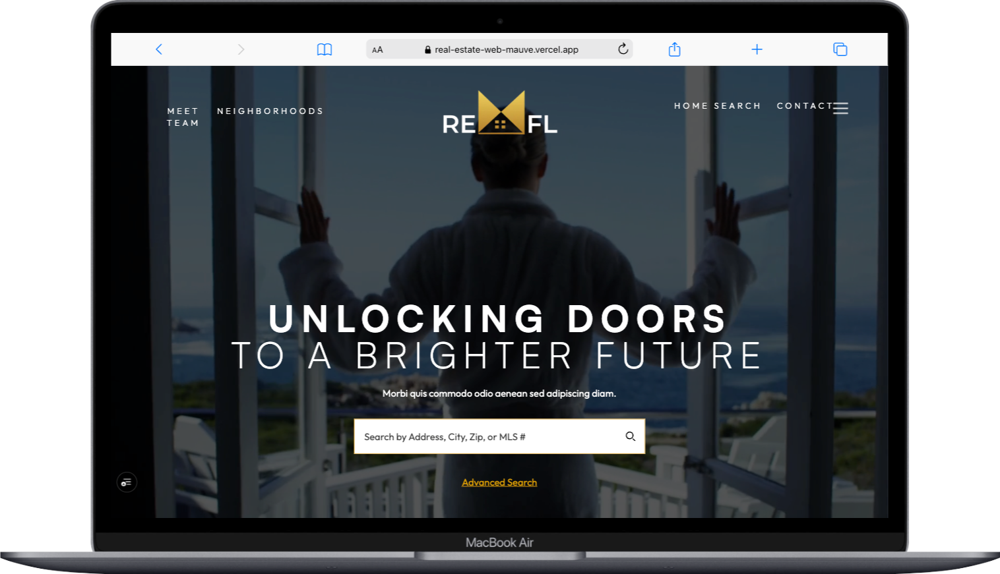

🏡 Real Estate Web

A professional, modern real estate website built with Next.js and Tailwind CSS. This project features a clean, responsive layout ideal for showcasing properties, promoting services, and connecting with potential clients.

[🔗 View Figma Design](https://www.figma.com/design/7sQH6DXwv9ynMuW2IGwif3/Porfolio-Designs?node-id=0-1&t=FYjGUKQ5NyFJcpWV-1)

✨ Features
✅ Fully responsive layout (desktop, tablet, mobile)

🏠 Property, services, and team sections

📧 Contact forms integrated with EmailJS or Basin

🌙 Optional dark mode

⚡ Fast performance with server-side rendering

📸 Optimized image handling

🖋️ Custom Google Fonts with next/font

Project Structure

/app          → Main app folder (Next.js 13+)
/components   → Reusable UI components
/public       → Static assets (images, etc.)
/styles       → Global styles
🚀 Getting Started
1. Clone the repository
git clone https://github.com/lcamps88/Real-Estate-Web.git
cd Real-Estate-Web

2. Install dependencies
npm install

3. Run the development server
npm run dev
Open http://localhost:3000 to view the app.

Deployment
Deploy effortlessly with Vercel — fully optimized for Next.js.

🔐 Environment Variables:
Create a .env.local file for your API keys:
NEXT_PUBLIC_EMAILJS_KEY=your_emailjs_key

👩‍💻 Author: 
Lisandra Camps

📄 License
This project is licensed under the MIT License.
